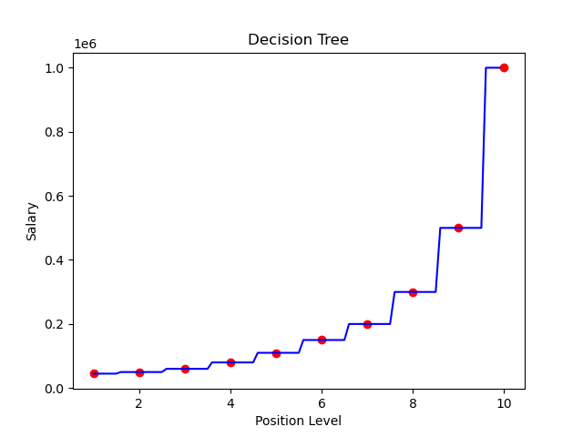

# Decision Tree Regression

## Project Overview
This project demonstrates the use of Decision Tree Regression to predict salaries based on position levels. The model effectively captures non-linear patterns in the dataset, showcasing its strength in handling such problems.

## Dataset
The dataset (`Position_Salaries.csv`) contains the following columns:
- `Position`: The title of the job position.
- `Level`: The numerical representation of the position level.
- `Salary`: The actual salary for the given position.

## Requirements
To run this project, you need the following Python libraries installed:
- `pandas`
- `numpy`
- `matplotlib`
- `sklearn`

Install the required libraries using:
```bash
pip install pandas numpy matplotlib scikit-learn
```

## Usage
1. Clone this repository and navigate to the project folder.
2. Ensure the dataset (`Position_Salaries.csv`) is in the same directory as the Jupyter Notebook or Python script.
3. Open and run the Jupyter Notebook (`Decision Tree.ipynb`) to train the model and generate predictions.

Alternatively, you can run the script using:
```bash
python decision_tree_script.py
```

## Project Structure
```
├── Decision Tree.ipynb    # Jupyter Notebook containing the implementation
├── decision_tree_plot.png # Visualization of the decision tree regression
├── Position_Salaries.csv  # Dataset used for training and testing
├── README.md              # Project documentation
```

## Model Training and Evaluation
The Decision Tree Regression model is trained on the `Position` vs. `Salary` data. It effectively learns and predicts salary values using the decision tree algorithm. The evaluation plot shows the stepwise nature of the model predictions, which is a typical characteristic of Decision Tree Regression.

## Visualization
The following graph represents the results of the Decision Tree Regression model:



It showcases the stepwise prediction nature of the model, effectively approximating the salary for each position level.
